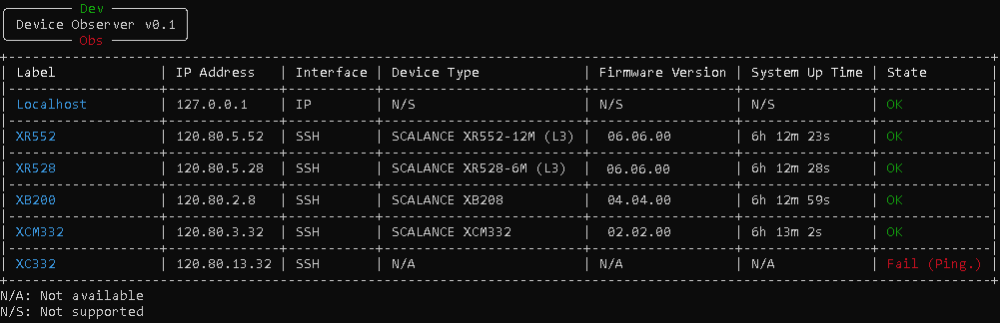
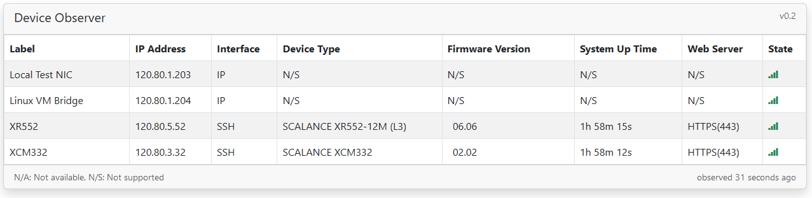

# DevObs
Device Observer aka "DevObs" is a command line based (for now) tool used to query the access status and some information of known IP based devices in your network environment.

## Description
If you're a developer, tester, or network engineer, you're likely to have a lot of IP-based equipment on your rack.
From time to time, some of your devices become inaccessible due to modified network settings, sometimes disconnected cables, changed passwords.
DevObs will help you see the availability and features of your devices at a glance.
<p>
First of all, the user saves which devices are available in his/her IP network to the DevObs database and then runs the application. DevObs will scan all registered devices and show you their status. Thanks to the easily expandable software structure, you can see all your devices and their features on DevObs.

## Installation
To install the application, follow the steps below:
### Prerequisites
- Python 3.x installed on your system (tested with 3.11)
- pip package manager installed. (It usually comes bundled with Python.)
- Internet connection to install dependencies 
### Steps
1. Clone the repository or download the source code.
```git clone <repository_url>```
2. Navigate to the project directory
```cd <project_directory>```
3. Adapt the ```data/config.yml``` configuration database file according to the devices in your IP network based on template in the file.
Ensure that classname fields are correctly set. 
   * Device class names must be based on the name of Python classes inside the files under ```backend/devices/*```
   * Communication (comm) class names must be based on the name of Python classes under ```backend/comm.py```

4. Start the application by:
- For Windows: ```devobs```
- For Linux:
  - First, allow execution```chmod +x devobs.sh``` 
  - Then run ```./devobs.sh```
- <b>NOTE:</b> If you update the software by pulling new resources, delete the ```myenv``` folder to for the script to install new requirements.

## Visuals
### Command Line Interface

Description of the fields in the output
* Label: This is the name assigned to the device in the configuration database file
* IP Address: This is the address assigned to the device in the configuration database file.
The tool queries the device based on this IP address
* Interface: This is interface used in the query and based on the assignment in the configuration database file.
* Device Type: This is an attribute of device that shows detailed type of the device.
  *  This is supported by devices like Siemens SCALANCE.
* Firmware Version: This is an attribute of device that shows the firmware version of the device.
  *  This is supported by devices like Siemens SCALANCE.
* System Up Time: This is an attribute of device that shows since when device running.
  *  This is supported by devices like Siemens SCALANCE.
* State: This is current state of access. If there's no problem communicating with the device, "OK" will be shown here.
If it's not "OK", "Fail" and reason of the fail, will be shown.
### Web UI
When the application started with ```-d``` flag, a web server started at port 5000, and you can see the devices in web via http://localhost:5000 

## Supported Devices
| Device                                 | Ping<br/>check | SSH<br/>check | Device Type | FW version | Up time | Custom features        |
|----------------------------------------|----------------|---------------|-------------|------------|---------|------------------------|
| Any IP supporting device               | Yes            |               |             |            |         |                        |
| Any SSH supporting device              | Yes            | Yes           |             |            |         |                        |
| Siemens SCALANCE 2nd Gen               | Yes            | Yes           | Yes         | Yes        | Yes     | You can<br/>add easily |
| Siemens SCALANCE 3rd Gen               | Yes            | Yes           | Yes         | Yes        | Yes     | You can<br/>add easily |
| ...You can add new device types easily | Yes            | Yes           | You can<br/>add easily         | You can<br/>add easily        | You can<br/>add easily     | You can<br/>add easily |

## Coding new devices
All you need to do is adding a new child of ```Device``` base class to a new Python module
under ```backend\devices```. You can implement existing attributes from ```Attributes``` class in ```device``` module
or add brand-new attribute as described below. You can inspect and base on existing devices classes in devices folder.

## Coding new attributes
If you want to implement an attribute querying&showing:
* If the attribute is not known by DevObs, it needs to be added to ```Attributes``` class.
* If the attribute is already in ```Attributes```, no change necessary in this class

Basically, we call add_attribute in constructor of device specific class, passing the following:
* Corresponding ```Attributes``` reference
* The minimum required connection stage. To be able to run a command in target CLI,
mostly application level authentication must be OK. So in most cases you'll have ```CommStage.AUTH_OK``` here
* The 'get' item to retrieve a block of information that contains the value the intended feature.
  * This can be either a function getting this value or
  * A request string (command in case of SSH) to run on established connection
* The 'parser' item to extract the value of the attribute
  * This can be either a function extracting this value or
  * A regex pattern to extract the value speficied with a match pattern "(...)"
```
self.add_attribute(Attributes.DEV_TYPE, CommStage.AUTH_OK, 'show system hardware | until chassis',
                           r"^(.+)\s+chassis\s+Family")
``` 

## Contact
For problems, ideas, discussions etc. You may contact me at aliakyurek@gmail.com
## Roadmap
* Web based management
* Not only diagnostic but also device management
* Not only CLI/SSH but also SNMP for queries
* Periodic updates
* AI chatbot for management
* ...
## Contributing
If you implement new devices, PRs are welcome.
## Authors and acknowledgment
Thanks to Burak Özcan [@ozcanburakk] for test feedback.
## License
MIT
